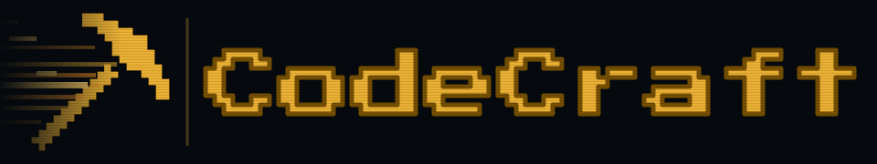

<div align="center">
  
</div>

## About

**CodeCraft** is a DSL (domain-specific language) that lets you script and automate actions in Minecraft. Developed by students of Software Engineering at the Technical University of Moldova:

- Chiril Boboc — [@KyronPomidor](https://github.com/KyronPomidor)
- Vasile Brînză — [@Kynexi](https://github.com/Kynexi)
- Cristian Bruma — [@Makday](https://github.com/Makday)
- Gabriela Bîtca — [@gabr1ela0](https://github.com/gabr1ela0)
- Teodor Strulea — [@Strulea-Teodor](https://github.com/Strulea-Teodor)

## Repository Structure

```
codecraft/
├── src/                  # Maven standard layout (main & test sources)
├── docs/
│   ├── week_1/           # Progress reports by week
│   ├── week_2/
│   └── ...
│   └── week_x/
│   └── Report/           # LaTeX source + compiled PDF report              
└── pom.xml
```

## Getting Started

### Prerequisites

- Java (version 17 or higher)
- Maven (or use the included wrapper)

### Running the Project

**Windows:**
```bash
mvnw clean compile exec:java
```

**macOS / Linux:**
```bash
./mvnw clean compile exec:java
```

This compiles the project and runs the `Main` class.
